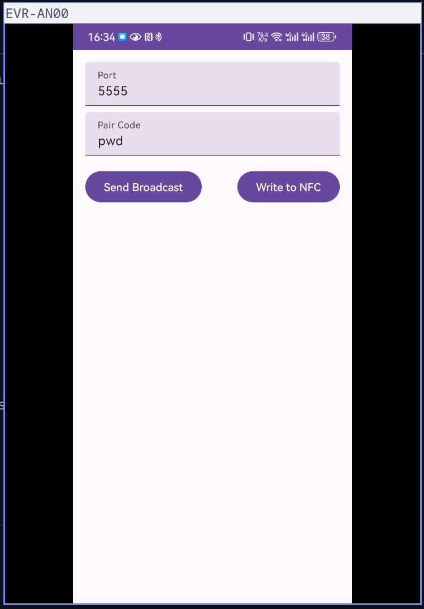

> ✨ This project is almost written by AI✨

# C2C (Connect-to-Computer)

A utility application that enables secure wireless connection between your Android device and computer using scrcpy, with NFC-based pairing for easy setup.

## Overview

C2C (Connect-to-Computer) is a modern Android application that simplifies the process of connecting your Android device to your computer wirelessly using scrcpy. It uses NFC for easy pairing and provides a secure connection using pair codes.



## Prerequisites

Before using C2C, you need to have the following installed on your computer:

1. **ADB (Android Debug Bridge)**

   - For Ubuntu/Debian: `sudo apt install adb`
   - For Arch Linux: `sudo pacman -S android-tools`
   - For macOS: `brew install android-platform-tools`
2. **scrcpy**

   - For Ubuntu/Debian: `sudo apt install scrcpy`
   - For Arch Linux: `sudo pacman -S scrcpy`
   - For macOS: `brew install scrcpy`
3. **Enable USB Debugging**

   - On your Android device, go to Settings > About Phone
   - Tap "Build Number" 7 times to enable Developer Options
   - Go to Settings > Developer Options
   - Enable "USB Debugging"

## Setup Process

1. **Initial Setup (One-time)**

   - Connect your Android device to computer via USB
   - Run `adb devices` to verify your device is recognized
   - Run `adb tcpip 5555` to enable TCP/IP mode
   - You can now disconnect the USB cable
2. **Using Pair Codes**

   - A pair code is a security measure to ensure only authorized connections
   - When starting the server, provide a pair code: `./c2c -pairCode "your-chosen-code"`
   - The same pair code must be entered in the Android app
   - Example: `./c2c -pairCode "secure123"`
3. **Port Configuration**

   - Default ADB port is 5555
   - The application uses port 8888 for UDP communication
   - Ensure these ports are not blocked by your firewall
   - You can verify port status: `netstat -an | grep 5555`

## Project Structure

### Android Client (`/c2c`)

- Built with Kotlin
- Handles NFC pairing and secure connection setup
- Manages port configuration and pair code validation
- Provides easy-to-use interface for wireless connection

### Server Component (`/server`)

- Written in Go
- Manages scrcpy connection
- Handles pair code verification
- Provides system notifications for connection status

## Building the Server

To build the server component:

1. **Install Go**

   - For Ubuntu/Debian: `sudo apt install golang`
   - For Arch Linux: `sudo pacman -S go`
   - For macOS: `brew install go`
2. **Build the Binary**

   ```bash
   cd server
   go build
   ```
3. **Run the Server**

   ```bash
   ./server -pairCode "your-chosen-code"
   ```

## Getting Started

### Running the Server

```bash
# Start the server with a pair code
./server -pairCode "your-secure-code"
```

### Using the Android App

1. Install the app on your Android device
2. Enter the same pair code as used in the server
3. Tap the connect button
4. If NFC is available, you can also use NFC pairing by touching your device to another paired device

### Troubleshooting

- Ensure both devices are on the same network
- Check if ports 5555 and 8888 are open
- Verify USB debugging is enabled
- Make sure the pair codes match exactly
- Check if ADB is running: `adb devices`
- Restart ADB if needed: `adb kill-server && adb start-server`

## Security

The application implements several security measures:

- Secure pairing using NFC
- Pair codes for additional security
- SHA-256 hashing for key generation
